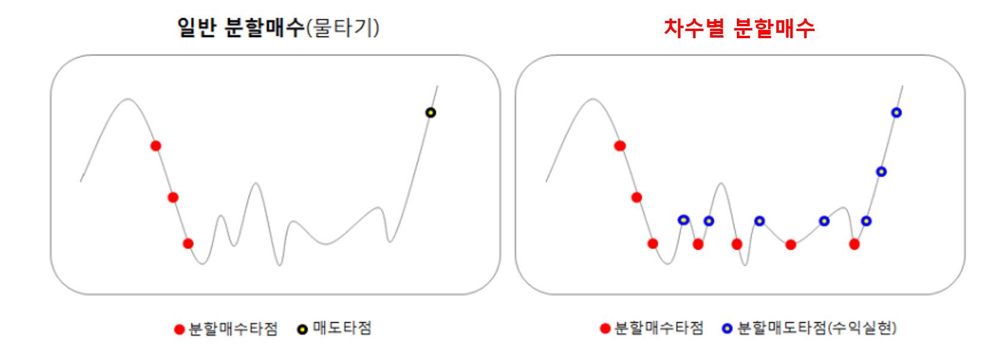

# 분할 투자 전략 최적화 (Split Investment Strategy Optimizer)

## 개요

이 프로젝트는 분할 투자 전략을 백테스팅하고 최적화하여 실제 투자에 적용하는 것을 목표로 합니다. 분할 투자 전략은 주식이나 ETF의 가격이 일정 비율로 하락할 때 분할 매수하고, 일정 비율로 상승할 때 분할 매도하는 전략입니다. 이를 통해 리스크를 관리하고 최적의 파라미터 조합을 찾아 최고의 성과를 내는 것을 목표로 합니다.

## 주요 기능

### 1. 주식 및 ETF 데이터 수집
- **주식 및 ETF 데이터 수집 스크립트**:
  - `ticker_collector.py`: 주식 티커 정보를 수집합니다.
  - `stock_data_collector.py`: 주식 가격 데이터를 수집하고 MySQL 데이터베이스에 저장합니다.
  - `etf_data_collector.py`: ETF 가격 데이터를 수집하고 MySQL 데이터베이스에 저장합니다.
    - PER, PBR, 배당수익률 등의 조건을 만족하는 주식만 저장합니다.
    - 상장폐지된 주식 및 조건을 만족하지 않는 주식을 필터링여부를 결정합니다.
    - 효율적인 업데이트를 위해 별도의 `ticker_status` 테이블을 사용합니다.

### 2. 분할 투자 전략 백테스팅
- **백테스팅 최적화기**:
  - `backtest_strategy.py`: 핵심 백테스팅 전략 및 로직이 포함되어 있습니다.
  - `single_backtest.py`: 단일 백테스팅 실행 스크립트입니다.
  - `parameter_simulation.py`: 여러 백테스팅을 병렬로 실행하여 최적의 파라미터를 찾는 스크립트입니다.

### 3. 데이터 파이프라인
- **데이터 파이프라인**:
  - `data_pipeline.py`: 전체 데이터 수집 및 데이터베이스 설정 파이프라인을 설정합니다.
  - `db_setup.py`: 데이터베이스 설정 및 테이블 생성을 처리합니다.

### 4. 웹 인터페이스
- **Flask 애플리케이션**:
  - `app.py`: Flask 애플리케이션을 초기화하고 라우팅을 설정합니다.
  - `templates/index.html`: 웹 인터페이스 템플릿입니다.
  - `static/css/styles.css`: 웹 인터페이스를 위한 스타일 시트입니다.
  - `static/js/scripts.js`: 웹 인터페이스를 위한 자바스크립트 파일입니다.

## 분할 투자 전략 설명

분할 투자 전략은 주식이나 ETF의 가격이 일정 비율로 하락할 때 분할 매수하고, 일정 비율로 상승할 때 분할 매도하는 전략입니다. 이를 통해 리스크를 관리하고 일정한 수익을 목표로 합니다. 

각 주식은 `n`단계(`num_splits`)로 분할 매도 매수를 진행하며, 단계별 수익률은 다음과 같이 계산됩니다.

### 계산 방법
1. **추가 매수 하락률**:
    - **목표**: 각 단계별로 주가가 일정 비율 하락할 때 추가 매수를 진행합니다.
    - **공식**:
    ```python
    def calculate_additional_buy_drop_rate(last_buy_price, five_year_low, num_splits):
        return 1 - ((five_year_low / last_buy_price) ** (1 / (num_splits - 1)))
    ```

2. **매도 수익률**:
    - **목표**: 각 단계별로 주가가 일정 비율 상승할 때 매도를 진행합니다.
    - **공식**:
    ```python
    def calculate_sell_profit_rate(buy_profit_rate):
        return (1 / (1 - buy_profit_rate)) - 1
    ```

## 백테스팅 목표

백테스팅의 목표는 다양한 변수를 조정하여 여러 투자 기간 동안 평균 성과가 가장 좋은 조합을 도출하는 것입니다:
- **분할 단계 수 (`num_splits`)**: 주식당 최대 분할 가능한 횟수를 조정하여 가장 좋은 성과를 보이는 파라미터를 도출합니다.
    * 예: [10, 20, 30]
- **투자 비율 (`investment_ratio`)**: 전체 자본 중에서 각 단계별로 투입할 금액의 비율을 조정하여 가장 좋은 성과를 보이는 비율을 도출합니다. 실제로 각 단계별로 투입되는 금액은 `investment_ratio / num_splits`로 나눠집니다.
    * 예: [0.25, 0.3, 0.35]
- **초기 매수 기준 값 (`normalized value`)**: 5년 종가를 기준으로 최고가와 최저가를 통해 min-max 스케일링한 값을 조정하여 가장 좋은 성과를 보이는 기준 값을 도출합니다.
- **매수 임계값 (`buy_threshold`)**: 주식이 매수되는 기준이 되는 `normalized value`를 조정하여 가장 좋은 성과를 보이는 값을 도출합니다.
    * 예: [30, 40, 50]
- **PER 임계값 (`per_threshold`)**: 주식의 PER 값을 조정하여 조건을 만족하는 주식을 선택합니다.
    * 예: [5, 10, 15]
- **PBR 임계값 (`pbr_threshold`)**: 주식의 PBR 값을 조정하여 조건을 만족하는 주식을 선택합니다.
    * 예: [0.5, 1, 1.5]
- **배당 수익률 임계값 (`div_threshold`)**: 주식의 배당 수익률을 조정하여 조건을 만족하는 주식을 선택합니다.
    * 예: [1, 3]
- **추가 매수 하락률 (`min_additional_buy_drop_rate`)**: 추가 매수를 위한 하락률을 조정하여 가장 좋은 성과를 보이는 값을 도출합니다.
    * 예: [0.005, 0.015]
- **상장폐지 고려 여부 (`consider_delisting`)**: 상장폐지된 주식을 포함할지 여부를 설정합니다.
- **최대 보유 주식 수 (`max_stocks`)**: 포트폴리오에 포함될 최대 주식 수를 조정하여 가장 좋은 성과를 보이는 값을 도출합니다.
    * 예: [30, 45, 60]
- **랜덤 시드 (`seed`)**: 백테스팅의 일관성을 유지하기 위해 랜덤 시드를 고정합니다.

## 사용된 주요 라이브러리 및 툴
- `pykrx`: 한국 거래소 데이터를 가져오기 위해 사용.
- `pymysql`: MySQL 데이터베이스와의 연동을 위해 사용.
- `pandas`: 데이터 조작 및 분석을 위해 사용.
- `matplotlib`: 데이터 시각화를 위해 사용.
- `configparser`: 설정 파일을 읽고 쓰기 위해 사용.
- `numpy`: 수치 연산을 위해 사용.
- `concurrent.futures`: 병렬 처리를 위해 사용.
- `tqdm`: 프로세스 진행률을 표시하기 위해 사용.
- `flask`: 웹 인터페이스를 생성하기 위해 사용.

## 프로젝트 파일 설명

- **데이터 수집**:
  - `src/ticker_collector.py`: 주식 티커 정보를 수집합니다.
  - `src/stock_data_collector.py`: 주식 가격 데이터를 수집합니다.
  - `src/etf_data_collector.py`: ETF 가격 데이터를 수집합니다.
  - `src/data_pipeline.py`: 전체 데이터 수집 및 데이터베이스 설정 프로세스를 오케스트레이션합니다.

- **백테스팅**:
  - `src/backtest_strategy.py`: 핵심 백테스팅 전략 및 로직이 포함되어 있습니다.
  - `src/single_backtest.py`: 단일 백테스팅 실행 스크립트입니다.
  - `src/parameter_simulation.py`: 최적의 파라미터 조합을 찾기 위해 여러 백테스팅을 실행합니다.

- **웹 인터페이스**:
  - `src/app.py`: Flask 애플리케이션을 초기화하고 라우팅을 설정합니다.
  - `templates/index.html`: 웹 인터페이스 템플릿입니다.
  - `static/css/styles.css`: 스타일 시트 파일입니다.
  - `static/js/scripts.js`: 자바스크립트 파일입니다.

- **데이터베이스 설정**:
  - `src/db_setup.py`: 데이터베이스 설정 및 테이블 생성을 처리합니다.

## 주요 업데이트 경과

- **2024년 6월 16일**: 데이터를 엑셀 파일 대신 MySQL에 저장하도록 변경.
- **2024년 6월 27일**: MySQL에서 데이터를 가져와 백테스팅하는 로직으로 변경.
    - 조건에 해당하는 종목을 찾기 위해 하드 코딩 대신 SQL을 사용하여 데이터를 동적으로 가져오도록 수정.
    - 조건을 만족하는 종목을 랜덤하게 선택하도록 설정.
- **2024년 7월 5일**: 백테스팅에 상장폐지 종목 포함.
    - 상장폐지 종목의 가치를 상장폐지 전날의 종가로 계산하고 포트폴리오에서 제거.
    - 10년 동안 상장폐지 종목을 포함한 백테스팅 결과, 평균 연평균 수익률 최대 11%.
    - 상장폐지 종목을 제외한 백테스팅 결과, 연평균 수익률 최대 16.5%.
- **2024년 7월 24일**: 백테스팅을 구현할 수 있는 Flask 웹페이지 개발

## 향후 계획
1. **상장폐지 가능성 예측 모델**:
    - 재무 데이터와 시장 데이터를 기반으로 상장폐지 가능성을 평가하는 모델을 개발.
    - 모델을 백테스팅에 적용하여 포트폴리오 가치에 반영.
    - 상장폐지 걱정이 없는 ETF로 포트폴리오를 구성하고 최적의 파라미터를 찾는 모델 구축.

2. **성능 최적화**:
    - 대용량 데이터 처리를 위한 성능 최적화.
    - 백테스팅에 필요한 모든 데이터를 처음에 한 번에 불러와 캐시에 저장하고, 캐시에서 데이터를 조회하도록 로직 변경 시도.

3. **사용자 인터페이스 개선**:
    - 백테스팅 결과를 보다 직관적으로 시각화하고 분석할 수 있는 웹 기반 사용자 인터페이스 개발.

## 연락처 정보

추가 정보나 프로젝트 논의를 원하시면 [datageeky7@gmail.com]로 연락해 주세요.
